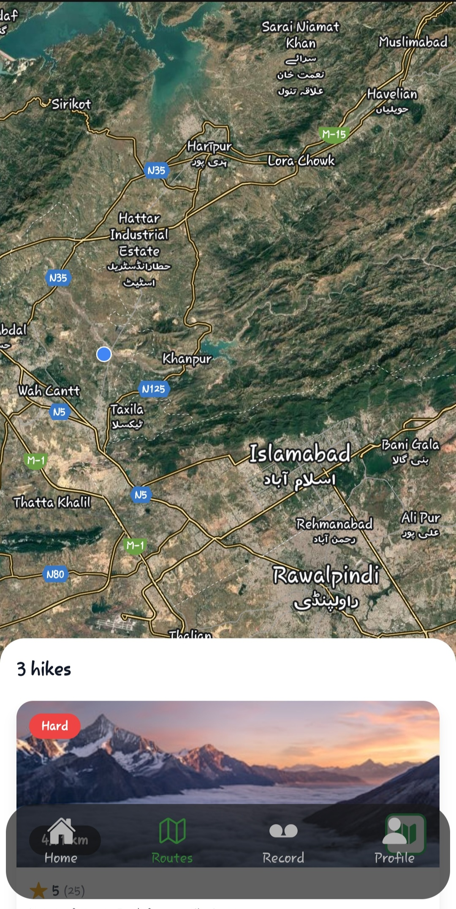
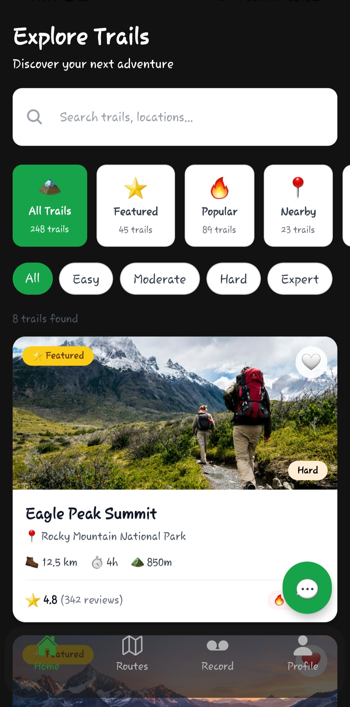
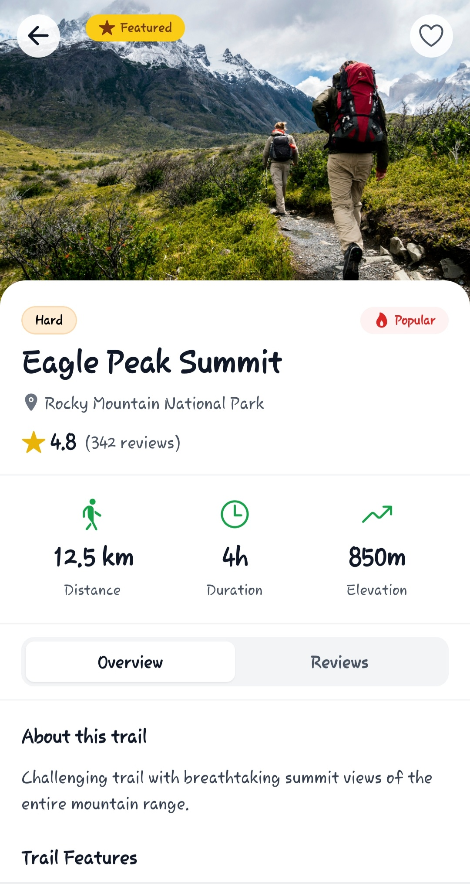

# 🏔️ Adventure Hiking App

<div align="center">


**Discover. Explore. Adventure.**

[Features](#-features) • [Installation](#-installation) • [Screenshots](#-screenshots) • [Tech Stack](#-tech-stack)

</div>

---

## 📱 About

Adventure Hiking App is your ultimate companion for discovering and tracking hiking trails. Plan your next adventure, save favorite locations, and navigate trails with confidence.

## ✨ Features

### 🗺️ **Interactive Map**
- Real-time GPS tracking
- Custom trail markers
- Offline map support
- Add your own hiking spots

### 🏃 **Trail Tracking**
- Distance & elevation tracking
- Duration monitoring
- Route history
- Performance analytics

### 📍 **Location Management**
- Save favorite trails
- Add custom waypoints
- Share locations with friends
- Trail difficulty ratings

### 👤 **User Profile**
- Personal hiking statistics
- Achievement badges
- Activity history
- Customizable preferences

### 🔐 **Authentication**
- Secure login with Clerk
- Google OAuth
- Apple Sign-In
- Email/Password support

---

## 🚀 Installation

### Prerequisites

Make sure you have the following installed:
- [Node.js](https://nodejs.org/) (v16 or higher)
- [npm](https://www.npmjs.com/) or [yarn](https://yarnpkg.com/)
- [Expo CLI](https://docs.expo.dev/get-started/installation/)

### Setup

1. **Clone the repository**
   ```bash
   git clone https://github.com/Haris-Khan-pro/expo-hike-app
   cd hiking-app
   ```

2. **Install dependencies**
   ```bash
   npm install
   # or
   yarn install
   ```

3. **Install Expo packages**
   ```bash
   npx expo install react-native-maps react-native-safe-area-context
   ```

4. **Configure environment variables**
   
   Create a `.env` file in the root directory:
   ```env
   EXPO_PUBLIC_CLERK_PUBLISHABLE_KEY=your_clerk_key_here
   GOOGLE_MAPS_API_KEY=your_google_maps_key_here
   ```

5. **Start the development server**
   ```bash
   npx expo start
   ```

6. **Run on device**
   - Scan QR code with Expo Go app (iOS/Android)
   - Press `i` for iOS simulator
   - Press `a` for Android emulator

---

## 📸 Screenshots

<div align="center">

### Main App Screens
| Welcome Screen |  |
|:---:|:---:|
|  | 

### Map Screens
| Map Screen |  |
|:---:|:---:|
|  | 

### Trail Details (Two Views)
| Overview | Advanced Stats |
|:---:|:---:|
|  |  |

</div>

---

## 🛠️ Tech Stack

### Frontend
- **React Native** - Cross-platform mobile framework
- **Expo** - Development and build tooling
- **TypeScript** - Type-safe JavaScript
- **NativeWind** - Tailwind CSS for React Native
- **Expo Router** - File-based routing

### Maps & Location
- **React Native Maps** - Interactive maps
- **Expo Location** - GPS tracking
- **Google Maps API** - Map data & services

### Authentication
- **Clerk** - User authentication
- **OAuth 2.0** - Social login (Google, Apple)

### UI/UX
- **Ionicons** - Icon library
- **Tailwind CSS** - Utility-first styling
- **React Native Safe Area Context** - Safe area handling

---

## 📂 Project Structure

```
hiking-app/
├── app/
│   ├── (auth)/
│   │   ├── components/
│   │   │   └── _SocialOAuthButton.tsx
│   │   ├── login.tsx
│   │   ├── signup.tsx
│   │   ├── welcome.tsx
│   │   ├── oauth-callback.tsx
│   │   └── _layout.tsx
│   ├── (tabs)/
│   │   ├── explore.tsx
│   │   ├── routes.tsx
│   │   ├── record.tsx
│   │   └── profile.tsx
│   └── _layout.tsx
├── assets/
│   ├── images/
│   └── icons/
├── components/
├── constants/
├── tailwind.config.js
├── package.json
└── README.md
```

---

## 🎨 Color Palette

```css
/* Primary Colors */
--primary: #2ECC71        /* Nature Green */
--primary-light: #58D68D
--primary-dark: #27AE60

/* Background */
--background: #121212      /* Dark */
--background-light: #181818
--background-lighter: #282828

/* Accent Colors */
--accent-orange: #FF6B35
--accent-blue: #3498DB
--trail-easy: #2ECC71
--trail-moderate: #F39C12
--trail-hard: #E74C3C
```

---

## 🔑 Environment Variables

| Variable | Description | Required |
|----------|-------------|----------|
| `EXPO_PUBLIC_CLERK_PUBLISHABLE_KEY` | Clerk authentication key | ✅ |
| `GOOGLE_MAPS_API_KEY` | Google Maps API key | ✅ |

---

## 📝 Scripts

```bash
# Start development server
npm start

# Start with cache cleared
npm run start:clear

# Run on iOS
npm run ios

# Run on Android
npm run android

# Run tests
npm test

# Build for production
npm run build
```

---

## 🤝 Contributing

Contributions are welcome! Please follow these steps:

1. Fork the repository
2. Create a feature branch (`git checkout -b feature/AmazingFeature`)
3. Commit your changes (`git commit -m 'Add some AmazingFeature'`)
4. Push to the branch (`git push origin feature/AmazingFeature`)
5. Open a Pull Request

---

## 📄 License

This project is licensed under the MIT License - see the [LICENSE] (LICENSE) file for details.

---

## 👨‍💻 Author

**Muhammad Haris Khan**
- GitHub: [@Haris-Khan-pro](https://github.com/Haris-Khan-pro)
- LinkedIn: [Your LinkedIn](https://linkedin.com/in/mharis-khan)
- Email: hariskhan01.gsm@gmail.com

---

## 🙏 Acknowledgments

- [Expo Documentation](https://docs.expo.dev/)
- [React Native Maps](https://github.com/react-native-maps/react-native-maps)
- [Clerk Authentication](https://clerk.com/)
- [NativeWind](https://www.nativewind.dev/)
- [Ionicons](https://ionic.io/ionicons)

---

<div align="center">

**Made with ❤️ and ☕**

⭐ Star this repo if you find it helpful!

</div>